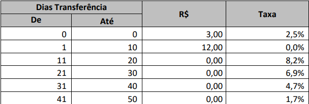

# Processo seletivo Wayon x Tokio Marine
Projeto que simula um sistema de agendamento de transações financeiras. Uma taxa é calculada conforme a data e valor do agendamento



## Estrutura do projeto
### **transferencias-api** - Backend em SpringBoot
> Java 21 \
> SpringBoot 3.1.4

### **transferencias-spa** - Frontend em Angular
> Angular CLI: 16.2.4 \
> Node: 18.18.0 \
> Package Manager: npm 9.8.1
> Angular Material: 16.2.9

## Iniciando o projeto
### Backend (SpringBoot)
* Entrar no diretório transferencias-api
* Executar a aplicação Java utilizando a IDE
* Ou, se preferir, executar utilizando o Maven
```bash
mvn spring-boot:run
```

### Frontend (Angular)
* Entrar no diretório transferencias-spa
* Iniciar o projeto com os comandos abaixo
```bash
npm install
npm start
```
* Acessar o projeto `http://localhost:4200/`